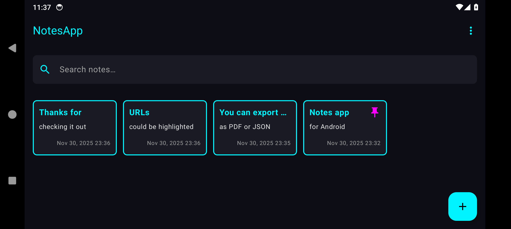

# Cyberpunk Notes App 🌃

A secure, cyberpunk-themed note-taking application for Android, built with modern Android technologies and a distinct visual style.

Developed live as part of live stream series:
https://www.youtube.com/playlist?list=PL0zZBw8Dq429NOr4MPDZHolp8UoFVuNPI



## 🚀 Technical Stack

- **Language**: Kotlin
- **UI Framework**: Jetpack Compose (Material3)
- **Architecture**: MVP (Model-View-Presenter)
- **Database**: Room (SQLite abstraction)
- **Security**: AndroidX Security Crypto (EncryptedSharedPreferences)
- **Asynchronous**: Kotlin Coroutines & Flow
- **Serialization**: GSON
- **PDF Generation**: iText7

## 🏗 Architecture & Components

The application follows the **MVP (Model-View-Presenter)** pattern to separate UI logic from business logic.

### 📱 Key Activities

1.  **`NotesActivity` (Main Entry)**
    -   **Role**: Displays the list of notes.
    -   **Logic**:
        -   Checks `SessionManager` and `PreferencesManager` on `onCreate`.
        -   Redirects to `LoginActivity` if a passcode is required and the session is invalid.
        -   Uses `NotesPresenter` to fetch data from `NotesRepository`.
    -   **UI**: `NotesListScreen` (Compose).

2.  **`NoteDetailActivity`**
    -   **Role**: Create, view, and edit individual notes.
    -   **Features**:
        -   Auto-save functionality.
        -   Export to PDF (`FileUtils`).
        -   Share note content.
    -   **UI**: `NoteDetailScreen` (Compose).

3.  **`LoginActivity`**
    -   **Role**: Handles secure access to the application.
    -   **Modes**:
        -   `SETUP`: Create a new passcode.
        -   `CONFIRM`: Verify the new passcode.
        -   `VALIDATE`: Unlock the app.
    -   **UI**: `LoginScreen` (Compose) with custom 4-digit PIN input and cyberpunk styling.

4.  **`SettingsActivity`**
    -   **Role**: Manage application settings.
    -   **Features**:
        -   Toggle "Require passcode on opening".
        -   Initiates the passcode setup flow.

### 🔐 Security & Session Management

The app implements a robust security model to protect user notes.

-   **Storage**: Passcodes are stored using **`EncryptedSharedPreferences`** (AES256-GCM), ensuring they are encrypted at rest and cannot be read even on rooted devices without the Keystore key.
-   **Session State**:
    -   Managed by **`SessionManager`** (Singleton).
    -   `isLoggedIn` flag tracks the current session.
    -   Session is cleared on process death or when the passcode is disabled.
    -   Prevents infinite login loops by checking both the enabled flag and session state.

### 💾 Data Layer

-   **`AppDatabase`**: Room database instance.
-   **`Note`**: Entity representing a note (id, title, content, timestamp, color).
-   **`NoteDao`**: Data Access Object for database operations.
-   **`NotesRepository`**: Abstraction layer between Presenters and the DAO.

### 🎨 UI & Theming

-   **Theme**: Custom Cyberpunk theme (`NotesAppTheme`).
-   **Colors**: Neon palette (Cyan, Magenta, Yellow) on dark backgrounds.
-   **Components**: Custom `CyberpunkCard`, `NeonButton`, and glitch-effect text styles.

## 📂 Project Structure

```
com.dmitryy.notesapp
├── data/           # Room entities, DAO, Database, Repository
├── ui/
│   ├── base/       # Base MVP interfaces
│   ├── list/       # Notes list screen (Activity, Presenter, Contract)
│   ├── detail/     # Note detail screen (Activity, Presenter, Contract)
│   ├── login/      # Login screen (Activity, Presenter, Contract)
│   ├── settings/   # Settings screen (Activity, Presenter, Contract)
│   └── theme/      # Compose theme and color definitions
└── utils/          # Helpers (Logger, FileUtils, PreferencesManager, SessionManager)
```
